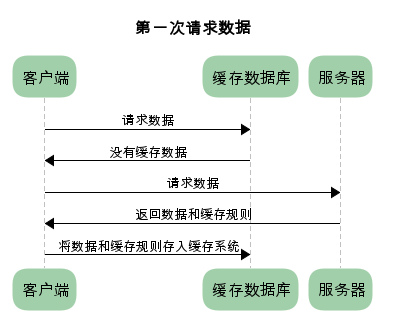
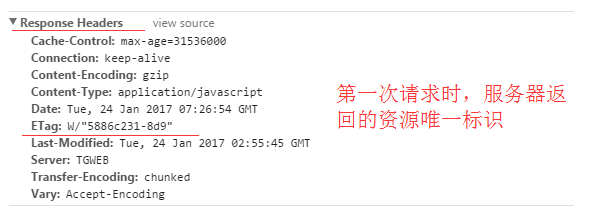
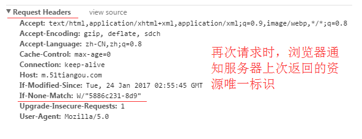

# 1，生命周期

从创建到渲染的过程，不仅仅问8个函数

四个阶段

组件创建时：creating：

模板渲染时：mounting

数据更新时：updating

组件卸载时：destroying

## 1.1 图示


## 1.2 生命周期钩子函数

beforeCreate：创建前，在数据观测和初始化事件还未开始

created：创建后，完成数据观测，属性和方法的运算，初始化事件，el属性还没有显示出来

beforeMount：载入前，在挂载开始之前被调用，相关的render函数首次被调用。实例已完成以下的配置：编译模板，把data里面的数据和模板生成html。注意此时还没有挂载html到页面上。

mounted：载入后，在el 被新创建的 vm.$el 替换，并挂载到实例上去之后调用。实例已完成以下的配置：用上面编译好的html内容替换el属性指向的DOM对象。完成模板中的html渲染到html页面中。此过程中进行ajax交互。

beforeUpdate：更新前，在数据更新之前调用，发生在虚拟DOM重新渲染和打补丁之前。可以在该钩子中进一步地更改状态，不会触发附加的重渲染过程。

updated：更新后，在由于数据更改导致的虚拟DOM重新渲染和打补丁之后调用。调用时，组件DOM已经更新，所以可以执行依赖于DOM的操作。然而在大多数情况下，应该避免在此期间更改状态，因为这可能会导致更新无限循环。该钩子在服务器端渲染期间不被调用。

beforeDestroy：销毁前，在实例销毁之前调用。实例仍然完全可用。

destroyed：销毁后，在实例销毁之后调用。调用后，所有的事件监听器会被移除，所有的子实例也会被销毁。该钩子在服务器端渲染期间不被调用。


### 1.3 回答的相关问题

1.什么是vue生命周期？
答： Vue 实例从创建到销毁的过程，就是生命周期。从开始创建、初始化数据、编译模板、挂载Dom→渲染、更新→渲染、销毁等一系列过程，称之为 Vue 的生命周期。

2.vue生命周期的作用是什么？
答：它的生命周期中有多个事件钩子，让我们在控制整个Vue实例的过程时更容易形成好的逻辑。

3.vue生命周期总共有几个阶段？
答：它可以总共分为8个阶段：创建前/后, 载入前/后,更新前/后,销毁前/销毁后。

4.第一次页面加载会触发哪几个钩子？
答：会触发 下面这几个beforeCreate, created, beforeMount, mounted 。

5.DOM 渲染在 哪个周期中就已经完成？
答：DOM 渲染在 mounted 中就已经完成了。


1. created阶段的ajax请求与mounted请求的区别：前者页面视图未出现，如果请求信息过多，页面会长时间处于白屏状态
2. mounted 不会承诺所有的子组件也都一起被挂载。如果你希望等到整个视图都渲染


# 2，组件封装

封装组件：主要是为了解耦，具备高性能、低耦合，在通用组件的时候要留一个插槽

```
<div id="demo">
   <v-header>
   </v-header>
</div>

<template id="header">
	<div>
		<p>{{msg}}:<input/></p>
	</div>
</template>
<script type="x-template" id="footer">
	<div>
		组件底部
	</div>
</script>
<script>
	var Header={
		template:"#header",
		data:function(){
			return {
				msg:""
			}
		}
	}
	var Header={
		template:"#footer"
	}
	var vm = new Vue({
		el:"#demo",
		components:{
			"v-header":Header,
			"v-footer":Footer
		}
	})
</script>
```

为什么data必须是一个函数：主要是防止组件与组件之前 声明的变量相互影响

# 3，axios

## 3.1 axios是什么？

​       axios是基于promise的用于浏览器和node.js的http客户端，主要作用就是向后退发送请求。

- 支持promise
- 提供并发方法：同时请求两个接口
- 提供了拦截器
- 提供支持CSRF（跨站请求伪造）


# 4，vuex

## 4.1 vuex是什么？

​        vuex为vue构建一个状态集管理，主要是为了解决组件状态共享的问题，强调的是集中式管理，便于便于维护，便于解耦，适用于大型项目


**state**
		Vuex 使用单一状态树,即每个应用将仅仅包含一个store 实例，但单一状态树和模块化并不冲突。存放的数据状态，不可以直接修改里面的数据。
**mutations**
		mutations定义的方法动态修改Vuex 的 store 中的状态或数据。
**getters**
		类似vue的计算属性，主要用来过滤一些数据。
**action**
		actions可以理解为通过将mutations里面处里数据的方法变成可异步的处理数据的方法，简单的说就是异步操作数据。view 层通过 store.dispath 来分发 action。

```
const store = new Vuex.Store({ //store实例
      state: {
         count: 0
             },
      mutations: {                
         increment (state) {
          state.count++
         }
          },
      actions: { 
         increment (context) {
          context.commit('increment')
   }
 }
})
```

**modules**
       项目特别复杂的时候，可以让每一个模块拥有自己的state、mutation、action、getters,使得结构非常清晰，方便管理。

```
const moduleA = {
  state: { ... },
  mutations: { ... },
  actions: { ... },
  getters: { ... }
 }
const moduleB = {
  state: { ... },
  mutations: { ... },
  actions: { ... }
 }

const store = new Vuex.Store({
  modules: {
    a: moduleA,
    b: moduleB
})
```


## 4.2 怎么使用？

vuex包含5个模块：

- state：存放数据的位置
- mutations：变更状态
- getters：动态变更数据
- actions：actions从动作层调用mutations去更改状态
- modules：拆分仓库

### 4.3 哪种场景使用它？

大型应用

# 5 vue指令

4个vue中的指令和它的用法

v-if：条件渲染指令，代表存在消耗

v-bind：用来绑定属性，简写(:)

v-on：监听指令，简写（@）

v-for：循环指令


# 6 导航钩子

​		vue-router 提供的导航守卫主要用来通过跳转或取消的方式守卫导航。

## 6.1 导航钩子有哪些？

导航钩子就是路由的生命周期函数，主要包括全局和局部。

### 6.1.1 全局钩子函数

beforeEach：路由切换开始调用，类似路由守卫

```
const router = new VueRouter({ ... })
router.beforeEach((to,from,next)=>{
//to:即将进入目标对象
//form:当前导航要离开的导航对象
//next:是一个函数，调用resolve
})
```

对于登录的设置案例：

```
router.beforeEach((to, from, next) => {
  if (to.name !== 'Login' && !isAuthenticated) next({ name: 'Login' })
  else next()
})
```

afterEach：路由切换离开时调用

### 6.1.2 局部的钩子函数

局部到单个路由：

- beforeEnter

组件的钩子函数：

- beforeRouterEnter
- beforeRouterUpdate
- beforeRouterLeave

## 7 v-model是什么？Vue中标签怎么绑定事件？

Vue利用v-model进行表单数据双向绑定，做了两个操作

- v-bind绑定一个value的属性
- v-on帮当前的元素绑定到一个事件上

```
<div id ="demo">
	<input v-model="inputValue"/>
	<p>{{inputValue}}</p>
	
	<input v-bind:value="inputValue2" v-on:input="inputValue2=$event.target.value"/>
	<p>{{inputValue2}}</p>
</div>
<script>
var vm = new Vue({
	el:"#demo",
	data:{
		inputValue:""
	}
})
</script>
```

# 8 如何使用Vue构建项目

```
npm install -g vue-cli
vue init webpack project_name
cd project_name
npm install
npm run dev
```

1，使用Vue-cli脚手架构建项目

2，直接引用vue.js进行项目的构建

# 9 swiper插件

​        swiper插件从后台获取数据没有问题，css代码也没有问题，但是图片没有动，怎么解决？

​         swiper提前初始化，这个时候数据还没有完全出来。

​         解决方法，主要有两个方向，一个从swiper，一个从vue方面

## 9.1 vue方面

vue方面：vue中专门提供了一个nextTick()，用于解决dom的先后执行问题

当数据加载完毕后，才执行swiper

```
mounted(){
	this.$nextTick(function(){
		var myswiper = new Swiper(".swiper-container",{
			autoplay:true
			loop:true
		})
	})
}
```

## 9.1 swiper方面

```
this.$nextTick(function(){
		var myswiper = new Swiper(".swiper-container",{
			autoplay:true
			loop:true，
			observer:true//自动帮我初始化wiper
			observeParents:true//当前swiper的父元素发生变化会初始化一次
		})
	})
```

# 10，路由懒加载

延迟加载、当需要的时候再加载，有效的分担首页的加载时间

```
//webpack chunk name
function resolveView(){
	return ()=>import(`@/cpmponents/${view}.vue`)
}

export default new Router({
	routes:[
	{
		path:'/',
		name:'HelloWorld',
		component:resolveView('HelloWorld')
	},
	{
		path:'/detail',
		name:'detail',
		component:resolveView('detail')
	}
	]
})
```

# 11 Vue-loader

vue-loader就是一个加载器，把Vue编译javaScript的模块，方便浏览器读文件。

## 11.1 为什么要转译vue组件

- 动态的渲染一些数据
- 对三个标签（template、script、style）都做了优化script中可以直接使用es6 style 也默认使用sass，
- 提供作用域的选择
- 开发阶段提供热加载


# 12 插槽

vue插槽：slot是一个占位

about.vue

```
<div>
	<slot></slot>
	<slot name="header"></slot>
	<slot name="footer" say="hello"></slot>
<div>
```


## 12.1 具名插槽

```
<div slot="header"></div>
```


## 12.2 默认插槽

默认插槽就是匿名插槽

```
<div></div>
```


## 12.3 作用域插槽

```
<div slot="footer" slot-scope="aaa">
	{{aaa}}
</div>
```

# 13 对vue虚拟DOM的理解（重点）

## 13.1 什么是虚拟dom？

​        使用js对象形式去添加dom元素，本质上是优化了diff算法，先在js上面批量更改，然后批量在真实节点上面修改。采用了新旧节点的对比，获取差异的dom，一次性更新到真实的dom上，从而

## 13.2 缺陷？

一般是同级或者兄弟层级的修改，尽量不要跨层级修改dom，设置key，可以最大的理由节点

# 14 MVVM模式

## 14.1 mvc

- 控制器：Controller
- 视图：View
- 模型：Model

## 14.2 MVVM（重看）

- Model：代表数据模型，也可以在Model中定义数据修改和操作的业务逻辑。
- View：代表UI 组件，它负责将数据模型转化成UI 展现出来。
- ViewModel：监听模型数据的改变和控制视图行为、处理用户交互，简单理解就是一个同步View 和 Model的对象，连接Model和View。

【模型】指的是后端传递的数据。【视图】指的是所看到的页面。【视图模型】mvvm模式的核心，它是连接view和model的桥梁。它有两个方向：一是将【模型】转化成【视图】，即将后端传递的数据转化成所看到的页面。实现的方式是：数据绑定。二是将【视图】转化成【模型】，即将所看到的页面转化成后端的数据。实现的方式是：DOM 事件监听。这两个方向都实现的，我们称之为数据的双向绑定。


​        在MVVM的框架下视图和模型是不能直接通信的。它们通过ViewModel来通信，ViewModel通常要实现一个observer观察者，当数据发生变化，ViewModel能够监听到数据的这种变化，然后通知到对应的视图做自动更新，而当用户操作视图，ViewModel也能监听到视图的变化，然后通知数据做改动，这实际上就实现了数据的双向绑定。并且MVVM中的View 和 ViewModel可以互相通信。

# 15 keep-alive

## 15.1 什么是keep-alive

​       它能让不活动的组件“活着”，从A页面跳转到B页面，一般从B页面返回A页面，A页面会重新加载，但是keep-alive会保存到内存里面。

它提供了include与exclude两个属性，允许组件有条件的缓存

## 15.2 实现的原理

在created时候，将需要缓存的vnode节点放到cache中，在render的时候根据name取出

## 15.3 使用

```
export default new Router({
	routes:[
	{
		path:'/',
		name:'HelloWorld',
		component:resolveView('HelloWorld'),
		meta:{
			keepAlive:true
		}
	},
	{
		path:'/detail',
		name:'detail',
		component:resolveView('detail'),
		meta:{
			keepAlive:true
		}
	}
	]
})
```

App.vue

```
<keep-alive>
   <router-view v-if="$route.meta.keepAlive">
</keep-alive>
```

# 16 Vue组件间的参数传递

## 16.1 父组件与子组件传值

父组件传给子组件：子组件通过props方法接受数据;
子组件传给父组件：$emit方法传递参数

## 16.2 非父子组件间的数据传递，兄弟组件传值

eventBus，就是创建一个事件中心，相当于中转站，可以用它来传递事件和接收事件。项目比较小时，用这个比较合适。

# 17，vue-cli如何新增自定义指令

## 17.1 创建局部指令

```
var app = new Vue({
    el: '#app',
    data: {    
    },
    // 创建指令(可以多个)
    directives: {
        // 指令名称
        dir1: {
            inserted(el) {
                // 指令中第一个参数是当前使用指令的DOM
                console.log(el);
                console.log(arguments);
                // 对DOM进行操作
                el.style.width = '200px';
                el.style.height = '200px';
                el.style.background = '#000';
            }
        }
    }
})
```

## 17.2 全局指令

```
<div id="app">
    <div v-dir1></div>
    <div v-dir2></div>
</div>
```

# 18 自定义过滤器

html代码：

```
<div id="app">
     <input type="text" v-model="msg" />
     {{msg| capitalize }}
</div>
```

JS代码：

```
var vm=new Vue({
    el:"#app",
    data:{
        msg:''
    },
    filters: {
      capitalize: function (value) {
        if (!value) return ''
        value = value.toString()
        return value.charAt(0).toUpperCase() + value.slice(1)
      }
    }
})
```

全局定义过滤器

```
Vue.filter('capitalize', function (value) {
  if (!value) return ''
  value = value.toString()
  return value.charAt(0).toUpperCase() + value.slice(1)
})
```

过滤器接收表达式的值 (msg) 作为第一个参数。capitalize 过滤器将会收到 msg的值作为第一个参数。

# 19 css只在当前组件起作用

答：在style标签中写入**scoped**即可 例如：<style scoped></style>

# 20 v-if 和 v-show 区别

答：v-if按照条件是否渲染，v-show是display的block或none；

# 21 和router的区别

答：是路由信息对象，包括，，，，，，等路由信息参数。而router是“路由实例”对象包括了路由的跳转方法，钩子函数等。

# 22 vue.js的两个核心是什么？

两个核心分别是数据驱动和组件系统

## 22.1 数据驱动

​		当数据发生变化的时候，用户界面发生相应的变化，开发者不需要手动的去修改dom。

## 22.2 组件系统

vue中的组件分为两种，全局组件和局部组件。

# 23 vue几种常用的指令

答：v-for 、 v-if 、v-bind、v-on、v-show、v-else

# 24 vue常用的修饰符？

答：.prevent: 提交事件不再重载页面；.stop: 阻止单击事件冒泡；.self: 当事件发生在该元素本身而不是子元素的时候会触发；.capture: 事件侦听，事件发生的时候会调用

# 25 v-on 可以绑定多个方法吗？

答：可以

# 26 vue中 key 值的作用？

答：当 Vue.js 用 v-for 正在更新已渲染过的元素列表时，它默认用“就地复用”策略。如果数据项的顺序被改变，Vue 将不会移动 DOM 元素来匹配数据项的顺序， 而是简单复用此处每个元素，并且确保它在特定索引下显示已被渲染过的每个元素。key的作用主要是为了高效的更新虚拟DOM。

# 27 什么是vue的计算属性？

答：在模板中放入太多的逻辑会让模板过重且难以维护，在需要对数据进行复杂处理，且可能多次使用的情况下，尽量采取计算属性的方式。好处：①使得数据处理结构清晰；②依赖于数据，数据更新，处理结果自动更新；③计算属性内部this指向vm实例；④在template调用时，直接写计算属性名即可；⑤常用的是getter方法，获取数据，也可以使用set方法改变数据；⑥相较于methods，不管依赖的数据变不变，methods都会重新计算，但是依赖数据不变的时候computed从缓存中获取，不会重新计算。

# 28 vue等单页面应用及其优缺点

答：优点：Vue 的目标是通过尽可能简单的 API 实现响应的数据绑定和组合的视图组件，核心是一个响应的数据绑定系统。MVVM、数据驱动、组件化、轻量、简洁、高效、快速、模块友好。
缺点：不支持低版本的浏览器，最低只支持到IE9；不利于SEO的优化（如果要支持SEO，建议通过服务端来进行渲染组件）；第一次加载首页耗时相对长一些；不可以使用浏览器的导航按钮需要自行实现前进、后退。

# 29 怎么定义 vue-router 的动态路由? 怎么获取传过来的值

答：在 router 目录下的 index.js 文件中，对 path 属性加上 /:id，使用 router 对象的 params.id 获取。

# 30 vue的双向绑定原理

# 31 vue项目优化

- Vue 代码层面的优化；
- webpack 配置层面的优化；
- 基础的 Web 技术层面的优化

## 31.1 代码层面的优化

### 31.1.1 v-if和v-show区分

**v-if** ： 条件渲染，在切换过程中条件块内的事件监听器和子组件适当地被销毁和重建；如果在初始渲染时条件为假，则什么也不做——直到条件第一次变为真时，才会开始渲染条件块。

**v-show** ：元素总是会被渲染，并且只是简单地基于 CSS 的 display 属性进行切换。所以，v-if 适用于在运行时很少改变条件，不需要频繁切换条件的场景；v-show 则适用于需要非常频繁切换条件的场景。

### 31.1.2 computed和watch区分

**computed：** 是计算属性，依赖其它属性值，并且 computed 的值有缓存，只有它依赖的属性值发生改变，下一次获取 computed 的值时才会重新计算 computed  的值；

**watch：** 更多的是「观察」的作用，类似于某些数据的监听回调 ，每当监听的数据变化时都会执行回调进行后续操作；

**运用场景：**

- 当我们需要进行数值计算，并且依赖于其它数据时，应该使用 computed，因为可以利用 computed 的缓存特性，避免每次获取值时，都要重新计算；
- 当我们需要在数据变化时执行异步或开销较大的操作时，应该使用 watch，使用 watch 选项允许我们执行异步操作 ( 访问一个 API )，限制我们执行该操作的频率，并在我们得到最终结果前，设置中间状态。这些都是计算属性无法做到的。

### 31.1.3 v-for遍历

v-for 遍历必须为 item 添加 key，且避免同时使用 v-if

#### 31.1.3.1 v-for 遍历必须为item添加 key

​		在列表数据进行遍历渲染时，需要为每一项 item 设置唯一 key 值，方便 Vue.js 内部机制精准找到该条列表数据。当 state 更新时，新的状态值和旧的状态值对比，较快地定位到 diff 。

#### 31.1.3.2 v-for 遍历避免同时使用 v-if

v-for 比 v-if 优先级高，如果每一次都需要遍历整个数组，将会影响速度，尤其是当之需要渲染很小一部分的时候，必要情况下应该替换成 computed 属性。

```
<ul>
  <li
    v-for="user in activeUsers"
    :key="user.id">
    {{ user.name }}
  </li>
</ul>
computed: {
  activeUsers: function () {
    return this.users.filter(function (user) {
   		return user.isActive
    })
  }
}
```

不推荐

```
<ul>
  <li
    v-for="user in users"
    v-if="user.isActive"
    :key="user.id">
    {{ user.name }}
  </li>
</ul>
```

### 31.1.4 长列表性能优化

​		Vue 会通过 Object.defineProperty 对数据进行劫持，来实现视图响应数据的变化，然而有些时候我们的组件就是纯粹的数据展示，不会有任何改变，我们就不需要 Vue 来劫持我们的数据，在大量数据展示的情况下，这能够很明显的减少组件初始化的时间，那如何禁止 Vue 劫持我们的数据呢？可以通过 Object.freeze 方法来冻结一个对象，一旦被冻结的对象就再也不能被修改了。

```
export default {
  data: () => ({
    users: {}
  }),
  async created() {
    const users = await axios.get("/api/users");
    this.users = Object.freeze(users);
  }
};
```

### 31.1.5 事件的销毁

Vue 组件销毁时，会自动清理它与其它实例的连接，解绑它的全部指令及事件监听器

```
created() {
  addEventListener('click', this.click, false)
},
beforeDestroy() {
  removeEventListener('click', this.click, false)
}
```

### 31.1.6 图片资源懒加载

图片过多的页面，为了加速页面加载速度，所以很多时候我们需要将页面内未出现在可视区域内的图片先不做加载， 等到滚动到可视区域后再去加载。我们在项目中使用 Vue 的 vue-lazyload 插件：

#### 31.1.6.1 安装插件

```
npm install vue-lazyload --save-dev
```

#### 31.1.6.2 man.js 中引入并使用

```
import VueLazyload from 'vue-lazyload'
```

#### 31.1.6.3 使用

```
Vue.use(VueLazyload)
```

或者添加自定义选项

```
Vue.use(VueLazyload, {
	preLoad: 1.3,
	error: 'dist/error.png',
	loading: 'dist/loading.gif',
	attempt: 1
})
```

#### 31.1.6.4 vue实现懒加载

​		在 vue 文件中将 img 标签的 src 属性直接改为 v-lazy ，从而将图片显示方式更改为懒加载显示：

```

```

### 31.1.7 路由懒加载

​		Vue  是单页面应用，可能会有很多的路由引入 ，这样使用 webpcak 打包后的文件很大，当进入首页时，加载的资源过多，页面会出现白屏的情况，不利于用户体验。如果我们能把不同路由对应的组件分割成不同的代码块，然后当路由被访问的时候才加载对应的组件，这样就更加高效了。这样会大大提高首屏显示的速度，但是可能其他的页面的速度就会降下来。

```
const Foo = () => import('./Foo.vue')
const router = new VueRouter({
  routes: [
    { path: '/foo', component: Foo }
  ]
})
```

### 31.1.8 插件按需引入

​		我们在项目中经常会需要引入第三方插件，如果我们直接引入整个插件，会导致项目的体积太大，我们可以借助 `babel-plugin-component` ，然后可以只引入需要的组件，以达到减小项目体积的目的。

#### 31.1.8.1 安装

```
npm install babel-plugin-component -D
```

#### 31.1.8.2 修改 .babelrc

```
{
  "presets": [["es2015", { "modules": false }]],
  "plugins": [
    [
      "component",
      {
        "libraryName": "element-ui",
        "styleLibraryName": "theme-chalk"
      }
    ]
  ]
}
```

#### 31.1.8.3 main.js 中引入部分组件

```
import Vue from 'vue';
import { Button, Select } from 'element-ui';

Vue.use(Button)
Vue.use(Select)
```

### 31.1.9 优化无限列表性能

​		应用存在非常长或者无限滚动的列表，那么需要采用 窗口化 的技术来优化性能，只需要渲染少部分区域的内容，减少重新渲染组件和创建 dom 节点的时间。你可以参考以下开源项目 vue-virtual-scroll-list 和 vue-virtual-scroller  来优化这种无限列表的场景的。

### 31.1.10 服务端渲染 SSR or 预渲染

​		服务端渲染是指 Vue 在客户端将标签渲染成的整个 html 片段的工作在服务端完成，服务端形成的 html 片段直接返回给客户端这个过程就叫做服务端渲染。

#### 31.1.10.1 服务端渲染的优点

##### 31.1.10.1.1 更好的SEO

​		因为 SPA 页面的内容是通过 Ajax 获取，而搜索引擎爬取工具并不会等待 Ajax 异步完成后再抓取页面内容，所以在 SPA 中是抓取不到页面通过 Ajax 获取到的内容；而 SSR 是直接由服务端返回已经渲染好的页面（数据已经包含在页面中），所以搜索引擎爬取工具可以抓取渲染好的页面；

##### 31.1.10.1.2 首屏加载更快

​		SPA 会等待所有 Vue 编译后的 js 文件都下载完成后，才开始进行页面的渲染，文件下载等需要一定的时间等，所以首屏渲染需要一定的时间；SSR 直接由服务端渲染好页面直接返回显示，无需等待下载 js 文件及再去渲染等，所以 SSR 有更快的内容到达时间；

#### 31.1.10.2 服务端渲染的缺点

##### 31.1.10.2.1 更多的开发条件限制

​		例如服务端渲染只支持 beforCreate 和 created 两个钩子函数，这会导致一些外部扩展库需要特殊处理，才能在服务端渲染应用程序中运行；并且与可以部署在任何静态文件服务器上的完全静态单页面应用程序 SPA 不同，服务端渲染应用程序，需要处于 Node.js server 运行环境；

##### 31.1.10.2.2 更多的服务器负载

​		在 Node.js 中渲染完整的应用程序，显然会比仅仅提供静态文件的 server 更加大量占用CPU 资源，因此如果你预料在高流量环境下使用，请准备相应的服务器负载，并明智地采用缓存策略。

#### 31.1.10.3 总结

​		如果你的项目的 SEO 和 首屏渲染是评价项目的关键指标，那么你的项目就需要服务端渲染来帮助你实现最佳的初始加载性能和 SEO，如果你的 Vue 项目只需改善少数营销页面（例如  `/， /about， /contac`t 等）的 SEO，那么你可能需要**预渲染**，在构建时 (build time) 简单地生成针对特定路由的静态 HTML 文件。优点是设置预渲染更简单，并可以将你的前端作为一个完全静态的站点，具体你可以使用 prerender-spa-plugin 就可以轻松地添加预渲染 。

## 31.2  Webpack 层面的优化

### 31.2.1 对图片进行压缩

​		在 vue 项目中除了可以在 `webpack.base.conf.js` 中 url-loader 中设置 limit 大小来对图片处理，对小于 limit 的图片转化为 base64 格式，其余的不做操作。所以对有些较大的图片资源，在请求资源的时候，加载会很慢，我们可以用 `image-webpack-loader`来压缩图片：

#### 31.2.1.1 安装 image-webpack-loader

```
npm install image-webpack-loader --save-dev
```

#### 31.2.1.2 配置

```
{
  test: /\.(png|jpe?g|gif|svg)(\?.*)?$/,
  use:[
    {
    loader: 'url-loader',
    options: {
      limit: 10000,
      name: utils.assetsPath('img/[name].[hash:7].[ext]')
      }
    },
    {
      loader: 'image-webpack-loader',
      options: {
        bypassOnDebug: true,
      }
    }
  ]
}
```

### 31.2.2 减少 ES6 转为 ES5 的冗余代码

​		Babel 插件会在将 ES6 代码转换成 ES5 代码时会注入一些辅助函数，例如下面的 ES6 代码：

```
class HelloWebpack extends Component{...}
```

​		这段代码再被转换成能正常运行的 ES5 代码时需要以下两个辅助函数：

```
babel-runtime/helpers/createClass  // 用于实现 class 语法
babel-runtime/helpers/inherits  // 用于实现 extends 语法
```

​		Babel 会在每个输出文件中内嵌这些依赖的辅助函数代码，如果多个源代码文件都依赖这些辅助函数，那么这些辅助函数的代码将会出现很多次，造成代码冗余。为了不让这些辅助函数的代码重复出现，可以在依赖它们时通过 `require('babel-runtime/helpers/createClass')` 的方式导入，这样就能做到只让它们出现一次。`babel-plugin-transform-runtime` 插件就是用来实现这个作用的，将相关辅助函数进行替换成导入语句，从而减小 babel 编译出来的代码的文件大小。

#### 31.2.2.1 安装插件

```
npm install babel-plugin-transform-runtime --save-dev
```

#### 31.2.2.2 修改 .babelrc

```
"plugins": [
    "transform-runtime"
]
```

### 31.2.3 提取公共代码

如果项目中没有去将每个页面的第三方库和公共模块提取出来，则项目会存在以下问题：

- 相同的资源被重复加载，浪费用户的流量和服务器的成本。
- 每个页面需要加载的资源太大，导致网页首屏加载缓慢，影响用户体验。

​		我们需要将多个页面的公共代码抽离成单独的文件，来优化以上问题 。Webpack 内置了专门用于提取多个Chunk 中的公共部分的插件 CommonsChunkPlugin，我们在项目中 CommonsChunkPlugin 的配置如下：

```
// 所有在 package.json 里面依赖的包，都会被打包进 vendor.js 这个文件中。
new webpack.optimize.CommonsChunkPlugin({
  name: 'vendor',
  minChunks: function(module, count) {
    return (
      module.resource &&
      /\.js$/.test(module.resource) &&
      module.resource.indexOf(
        path.join(__dirname, '../node_modules')
      ) === 0
    );
  }
}),
// 抽取出代码模块的映射关系
new webpack.optimize.CommonsChunkPlugin({
  name: 'manifest',
  chunks: ['vendor']
})
```

### 31.2.4 模板预编译

​		当使用 DOM 内模板或 JavaScript 内的字符串模板时，模板会在运行时被编译为渲染函数。通常情况下这个过程已经足够快了，但对性能敏感的应用还是最好避免这种用法。

​		预编译模板最简单的方式就是使用单文件组件——相关的构建设置会自动把预编译处理好，所以构建好的代码已经包含了编译出来的渲染函数而不是原始的模板字符串。

​		如果你使用 webpack，并且喜欢分离 JavaScript 和模板文件，你可以使用 vue-template-loader，它也可以在构建过程中把模板文件转换成为 JavaScript 渲染函数。

### 31.2.5 提取组件的 CSS

​		当使用单文件组件时，组件内的 CSS 会以 style 标签的方式通过 JavaScript 动态注入。这有一些小小的运行时开销，如果你使用服务端渲染，这会导致一段 “无样式内容闪烁 (fouc) ” 。将所有组件的 CSS 提取到同一个文件可以避免这个问题，也会让 CSS 更好地进行压缩和缓存。

- webpack + vue-loader ( vue-cli 的 webpack 模板已经预先配置好)
- Browserify + vueify
- Rollup + rollup-plugin-vue


### 31.2.6 优化 SourceMap

​		我们在项目进行打包后，会将开发中的多个文件代码打包到一个文件中，并且经过压缩、去掉多余的空格、babel编译化后，最终将编译得到的代码会用于线上环境，那么这样处理后的代码和源代码会有很大的差别，当有 bug的时候，我们只能定位到压缩处理后的代码位置，无法定位到开发环境中的代码，对于开发来说不好调式定位问题，因此 sourceMap 出现了，它就是为了解决不好调式代码问题的。

SourceMap 的可选值如下（+ 号越多，代表速度越快，- 号越多，代表速度越慢, o 代表中等速度 ）


**开发环境推荐：cheap-module-eval-source-map**

**生产环境推荐：cheap-module-source-map**

- **cheap**：源代码中的列信息是没有任何作用，因此我们打包后的文件不希望包含列相关信息，只有行信息能建立打包前后的依赖关系。因此不管是开发环境或生产环境，我们都希望添加 cheap 的基本类型来忽略打包前后的列信息；
- **module** ：不管是开发环境还是正式环境，我们都希望能定位到bug的源代码具体的位置，比如说某个 Vue 文件报错了，我们希望能定位到具体的 Vue 文件，因此我们也需要 module 配置；
- **soure-map** ：source-map 会为每一个打包后的模块生成独立的 soucemap 文件 ，因此我们需要增加source-map 属性；
- **eval-source-map**：eval 打包代码的速度非常快，因为它不生成 map 文件，但是可以对 eval 组合使用 eval-source-map 使用会将 map 文件以 DataURL 的形式存在打包后的 js 文件中。在正式环境中不要使用 eval-source-map, 因为它会增加文件的大小，但是在开发环境中，可以试用下，因为他们打包的速度很快。

### 31.2.7 构建结果输出分析

​		Webpack 输出的代码可读性非常差而且文件非常大，让我们非常头疼。为了更简单、直观地分析输出结果，社区中出现了许多可视化分析工具。这些工具以图形的方式将结果更直观地展示出来，让我们快速了解问题所在。接下来讲解我们在 Vue 项目中用到的分析工具：`webpack-bundle-analyzer` 。

在项目中 `webpack.prod.conf.js` 进行配置:

```
if (config.build.bundleAnalyzerReport) {
  var BundleAnalyzerPlugin =   require('webpack-bundle-analyzer').BundleAnalyzerPlugin;
  webpackConfig.plugins.push(new BundleAnalyzerPlugin());
}
```


## 31.3 Web 技术优化


### 31.3.1 GZIP打包

​		gzip 是 GNUzip 的缩写，最早用于 UNIX 系统的文件压缩。HTTP 协议上的 gzip 编码是一种用来改进 web 应用程序性能的技术，web 服务器和客户端（浏览器）必须共同支持 gzip。目前主流的浏览器，Chrome，firefox，IE等都支持该协议。常见的服务器如 Apache，Nginx，IIS 同样支持，gzip 压缩效率非常高，通常可以达到 70% 的压缩率，也就是说，如果你的网页有 30K，压缩之后就变成了 9K 左右

#### 31.3.1.1 安装gzip

```
npm install compression --save
```

#### 31.3.1.2 添加代码逻辑

```
var compression = require('compression');
var app = express();
app.use(compression())
```

### 31.3.2 浏览器缓存

​		为了提高用户加载页面的速度，对静态资源进行缓存是非常必要的，根据是否需要重新向服务器发起请求来分类，将 HTTP 缓存规则分为两大类（强制缓存，对比缓存）。

### 31.3.3 CDN 的使用

​		浏览器从服务器上下载 CSS、js 和图片等文件时都要和服务器连接，而大部分服务器的带宽有限，如果超过限制，网页就半天反应不过来。而 CDN 可以通过不同的域名来加载文件，从而使下载文件的并发连接数大大增加，且CDN 具有更好的可用性，更低的网络延迟和丢包率 。

### 31.3.4 使用 Chrome Performance 查找性能瓶颈

​		chrome 的 Performance 面板可以录制一段时间内的 js 执行细节及时间。使用 Chrome 开发者工具分析页面性能的步骤如下。

1. 打开 Chrome 开发者工具，切换到 Performance 面板
2. 点击 Record 开始录制
3. 刷新页面或展开某个节点
4. 点击 Stop 停止录制


# 32 vue兼容性

vue支持所有兼容ECMAScript5的浏览器，因IE8不支持ECMAScript5特性，故IE8及其以下浏览器均不支持vue。只要浏览器支持Object.defineProperty方法， vue 就能运行起来，但是该方法在IE8 以下的没有这个方法，所以支持不了。

## 32.1 3s延时触发

解决移动端某些版本的浏览器，点击事件有3s延时触发的问题

### 32.1.1 安装依赖

```
npm install fastclick --save-dev
```

### 32.1.2 绑定body

 在Vue项目的Main.js中将 fastclick 绑定到 body 即可

```
import fastClick from 'fastclick'
fastClick.attach(document.body)
```

## 32.2，不支持ES6新特性

低版本的安卓对ES6新特性不支持，这里需要引入两个包来进行转化，babel-polyfill和es6-promise

### 32.2.1 安装依赖包

```
npm install babel-polyfill

npm install es6-promise
```

### 32.2.2 引用依赖包

在 vue 项目的 mian.js 中引用即可

```
import 'babel-polyfill'

import Es6Promise from 'es6-promise'

require('es6-promise').polyfill()

ES6Promise.polyfill()
```

### 32.2.3  配置 

在webpack.base.conf.js里配置一下

```
module.exports = { 

　　entry: { 

　　　　"babel-polyfill":"babel-polyfill",

　　　　 app: './src/main.js'

}
```


## 32.3，清除 css 初始样式

### 32.3.1 新建reset.css文件

```
html, body, div, span, applet, object, iframe,
h1, h2, h3, h4, h5, h6, p, blockquote, pre,
a, abbr, acronym, address, big, cite, code,
del, dfn, em, img, ins, kbd, q, s, samp,
small, strike, strong, sub, sup, tt, var,
b, u, i, center,
dl, dt, dd, ol, ul, li,
fieldset, form, label, legend,
table, caption, tbody, tfoot, thead, tr, th, td,
article, aside, canvas, details, embed,
figure, figcaption, footer, header,
menu, nav, output, ruby, section, summary,
time, mark, audio, video, input {
    margin: 0;
    padding: 0;
    border: 0;
    font-size: 100%;
    font-weight: normal;
    vertical-align: baseline;
}

/* HTML5 display-role reset for older browsers */
article, aside, details, figcaption, figure,
footer, header, menu, nav, section {
    display: block;
}

body {
    line-height: 1;
}

blockquote, q {
    quotes: none;
}

blockquote:before, blockquote:after,
q:before, q:after {
    content: none;
}

table {
    border-collapse: collapse;
    border-spacing: 0;
}

/* custom */
a {
    color: #7e8c8d;
    text-decoration: none;
    -webkit-backface-visibility: hidden;
}

li {
    list-style: none;
}

::-webkit-scrollbar {
    width: 5px;
    height: 5px;
}

::-webkit-scrollbar-track-piece {
    background-color: rgba(0, 0, 0, 0.2);
    -webkit-border-radius: 6px;
}

::-webkit-scrollbar-thumb:vertical {
    height: 5px;
    background-color: rgba(125, 125, 125, 0.7);
    -webkit-border-radius: 6px;
}

::-webkit-scrollbar-thumb:horizontal {
    width: 5px;
    background-color: rgba(125, 125, 125, 0.7);
    -webkit-border-radius: 6px;
}

html, body {
    width: 100%;
}

body {
    -webkit-text-size-adjust: none;
    -webkit-tap-highlight-color: rgba(0, 0, 0, 0);
}
```

### 32.3.2 引入文件

```
import '@/assets/style/resrt.css'
```

## 32.4，history在IE9下不兼容

### 32.4.1 mode:'history'

​	首先mode:'history'在IE9下是不能使用的，如果是IE9，会变成hash的模式（在2项满足fallback:true条件后）

### 32.4.2 fallback属性

​		如果使用fallback(跟mode同一级别的属性,该属性默认为true)属性:

```
 fallback：true；当在IE9下默认变成hash
 fallback：true；强制使用history方式,此方式对于可以手动输入url，后台不做严格要求的网站是可行的
```

32.4.3 

3.有些网页不能使用输入Url的方式访问,后端也会对url做验证,这个时候不妨就让他变成hash模式,无非就是加个#的问题
不过需要注意的是,有些a标签的herf属性设置成#就会刷新整个页面的,我对这个问题的解决办法是:
1)删除herf属性
2)给a标签添加CSS:cursor: pointer;

## 32.5 对块级元素失效

​		低版本的安卓在一个就是弹性盒对块级元素的居中属性有可能会失效，所以尽量避免用弹性盒对块状元素进行居中，用绝对定位的上下左右设0，再加margin:auto进行居中。

## 32.6 边框不显示

​		低版本安卓的border的边框不显示：对border设置1px或0.01rem的边框可能会消失，这个解决方法可以用2px或0.02rem代替

## 32.7 逻辑像素问题

​		低版本安卓的逻辑像素和物理像素， 在使用rem作为单位的时候，其单位长度会跟随系统设置的字体大小变化而变化，所以我们要使用物理像素进行rem长度的计算而不是逻辑像素。

## 32.8 fixed问题

​		低版本安卓尽量避免使用fixed定位，移动端对fixed定位的支持很不友好，经常会出现一些奇奇怪怪的问题，所以最好还是避免或者减少fixed的使用。

## 32.9 按键问题

​		移动端键盘按下的$event事件和pc端有些不同，在控制台上把事件打印出来以后会发现移动端可能会少一些属性，所以在使用键盘按下事件的时候，最好先看一下移动端有没有这个属性。

## 32.10 页面自适应

​		在移动端如何做页面自适应，使用弹性盒，或者高度用rem,宽度用百分比

# 33 深度剖析HTTP缓存机制及原理

## 33.1 HTTP报文

​		HTTP报文就是浏览器和服务器间通信时发送及响应的数据块，浏览器向服务器请求数据，发送请求(request)报文；服务器向浏览器返回数据，返回响应(response)报文。

报文信息主要分为两部分：

- header：附加信息（cookie，缓存信息等）与缓存相关的规则信息
- body：HTTP请求真正想要传输的部分

## 33.2 缓存规则解析

​		我们假设浏览器存在一个缓存数据库,用于存储缓存信息。在客户端第一次请求数据时，此时缓存数据库中没有对应的缓存数据，需要请求服务器，服务器返回后，将数据存储至缓存数据库中。



​		HTTP缓存有多种规则，根据是否需要重新向服务器发起请求来分类，我将其分为强制缓存，对比缓存

1，已存在缓存数据时，仅基于强制缓存，请求数据的流程如下


2，已存在缓存数据时，仅基于对比缓存，请求数据的流程如下


​		两类缓存规则可以同时存在，强制缓存优先级高于对比缓存，也就是说，当执行强制缓存的规则时，如果缓存生效，直接使用缓存，不再执行对比缓存规则

## 33.3 强制缓存

​		强制缓存，在缓存数据未失效的情况下，可以直接使用缓存数据，那么浏览器是如何判断缓存数据是否失效呢？我们知道，在没有缓存数据的时候，浏览器向服务器请求数据时，服务器会将数据和缓存规则一并返回，缓存规则信息包含在响应header中。

​		对于强制缓存来说，响应header中会有两个字段来标明失效规则（Expires/Cache-Control），使用chrome的开发者工具，可以很明显的看到对于强制缓存生效时，网络请求的情况。

### 33.3.1 Expires

​		Expires的值为服务端返回的到期时间，即下一次请求时，请求时间小于服务端返回的到期时间，直接使用缓存数据。不过Expires 是HTTP 1.0的东西，现在默认浏览器均默认使用HTTP 1.1，所以它的作用基本忽略。
另一个问题是，到期时间是由服务端生成的，但是客户端时间可能跟服务端时间有误差，这就会导致缓存命中的误差。所以HTTP 1.1 的版本，使用Cache-Control替代。

### 33.3.2 Cache-Control

​		Cache-Control 是最重要的规则。常见的取值有private、public、no-cache、max-age，no-store，默认为private.

private:                			   客户端可以缓存
public:                    		    客户端和代理服务器都可缓存（前端的同学，可以认为public和private是一样的）
max-age=xxx:   				缓存的内容将在 xxx 秒后失效
no-cache:                          需要使用对比缓存来验证缓存数据（后面介绍）
no-store:                          所有内容都不会缓存，强制缓存，对比缓存都不会触发


Cache-Control仅指定了max-age，所以默认为private，缓存时间为31536000秒

## 33.4 对比缓存

​		对比缓存，顾名思义，需要进行比较判断是否可以使用缓存。浏览器第一次请求数据时，服务器会将缓存标识与数据一起返回给客户端，客户端将二者备份至缓存数据库中。再次请求数据时，客户端将备份的缓存标识发送给服务器，服务器根据缓存标识进行判断，判断成功后，返回304状态码，通知客户端比较成功，可以使用缓存数据。

​		第一次访问：


​		第二次访问：


​		通过两图的对比，我们可以很清楚的发现，在对比缓存生效时，状态码为304，并且报文大小和请求时间大大减少。原因是，服务端在进行标识比较后，只返回header部分，通过状态码通知客户端使用缓存，不再需要将报文主体部分返回给客户端。

​		缓存标识的传递是我们着重需要理解的，它在请求header和响应header间进行传递，一共分为两种标识传递

【Last-Modified  /  If-Modified-Since】和【Etag  /  If-None-Match】

### 33.4.1 Last-Modified  /  If-Modified-Since

1，Last-Modified：服务器在响应请求时，告诉浏览器资源的最后修改时间。


2，If-Modified-Since：

​		再次请求服务器时，通过此字段通知服务器上次请求时，服务器返回的资源最后修改时间。服务器收到请求后发现有头If-Modified-Since 则与被请求资源的最后修改时间进行比对。若资源的最后修改时间大于If-Modified-Since，说明资源又被改动过，则响应整片资源内容，返回状态码200；若资源的最后修改时间小于或等于If-Modified-Since，说明资源无新修改，则响应HTTP 304，告知浏览器继续使用所保存的cache。


### 33.4.2 Etag  /  If-None-Match

​		优先级高于Last-Modified  /  If-Modified-Since）

1，Etag：服务器响应请求时，告诉浏览器当前资源在服务器的唯一标识（生成规则由服务器决定）。



2，If-None-Match：

再次请求服务器时，通过此字段通知服务器客户段缓存数据的唯一标识。
服务器收到请求后发现有头If-None-Match 则与被请求资源的唯一标识进行比对，
不同，说明资源又被改动过，则响应整片资源内容，返回状态码200；
相同，说明资源无新修改，则响应HTTP 304，告知浏览器继续使用所保存的cache。



## 33.5 总结

- 强制缓存：服务器通知浏览器一个缓存时间，在缓存时间内，下次请求，直接用缓存，不在时间内，执行比较缓存策略。
- 比较缓存：将缓存信息中的Etag和Last-Modified通过请求发送给服务器，由服务器校验，返回304状态码时，浏览器直接使用缓存。

浏览器第一次请求：


浏览器再次请求时：

